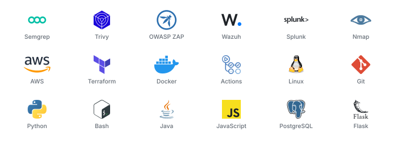
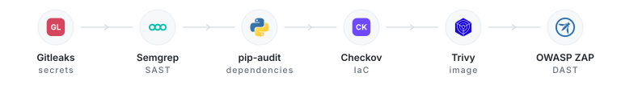

# Ramtin Kazemi

DevSecOps and cloud security. San Diego, CA.

I build CI pipelines that scan every layer before it ships, Terraform baselines that fail closed, and detection labs that prove the controls actually fire.

<picture>
  <source media="(prefers-color-scheme: dark)" srcset="assets/toolchain-dark.svg">
  
</picture>

## Security in CI

Every push and pull request against my Flask target app runs six classes of scan.

<picture>
  <source media="(prefers-color-scheme: dark)" srcset="assets/pipeline-dark.svg">
  
</picture>

Scans run non-blocking, so one pass returns the whole picture instead of stopping at the first finding. Bandit runs alongside Semgrep for Python-specific rules. ZAP tests the running container rather than the source, and uploads its report as a build artifact.

## Cloud hardening

Terraform baselines for AWS, written to be boring and reproducible.

* S3 with AES-256 at rest, versioning on, and all four public access paths blocked
* Security groups with zero inbound rules and HTTPS-only egress
* Default tags on every resource, so ownership and environment are never a question

Images follow the same rule. Slim base, dependencies installed before the app layer, a dedicated non-root user, gunicorn as the entrypoint, and nothing left in the final image an attacker could build with. Target runtime is ECS Fargate.

## Detection

Wazuh for file integrity monitoring, catching unauthorized changes to protected config. Splunk for authentication log analysis, including the brute force signature where repeated 401s from one source finally return a 200. Nmap for service and version enumeration. Lynis for host hardening audits.

## Cryptography

Graduate coursework in CYBR504. Recent labs: measuring CSPRNGs against non-cryptographic PRNGs, and recovering a Fernet key from a script that seeded Python's `random` with a Unix timestamp, then decrypting the file it was protecting.

## Projects

* [vulnerable-flask-lab](https://github.com/ramtinkazemi1/vulnerable-flask-lab): the pipeline above, built on we45's Vulnerable-Flask-App
* [CIFAR-10-MultiLayerNN](https://github.com/ramtinkazemi1/CIFAR-10-MultiLayerNN): multilayer neural network for image classification, Python
* [UC-San-Diego_map](https://github.com/ramtinkazemi1/UC-San-Diego_map): campus routing and graph search, JavaScript
* [Transitive-Closure-Calculator](https://github.com/ramtinkazemi1/Transitive-Closure-Calculator), [maze-solver](https://github.com/ramtinkazemi1/maze-solver), [BST](https://github.com/ramtinkazemi1/BST): Java

## Contact

[LinkedIn](https://www.linkedin.com/in/ramtinkazemi1/) · Open to security engineering roles
